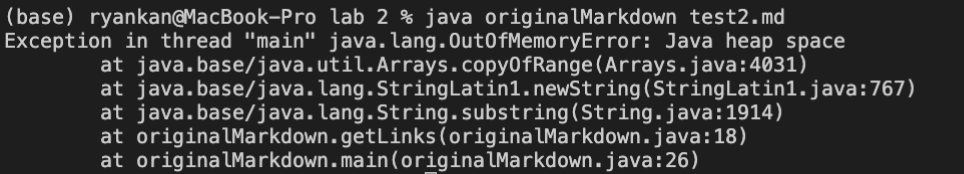
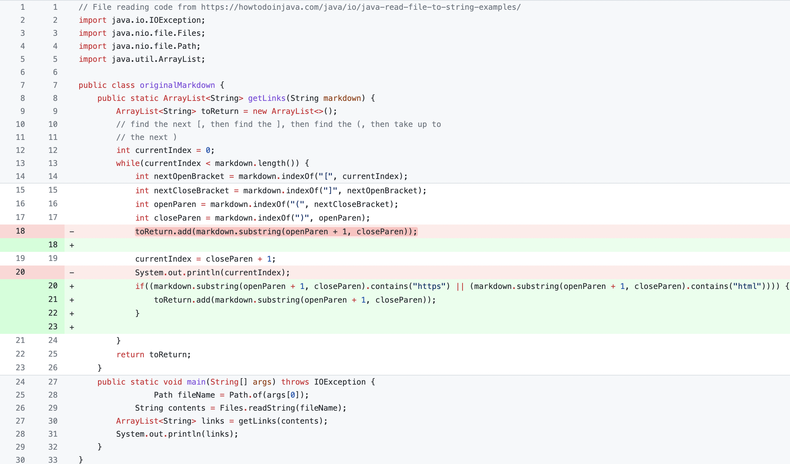
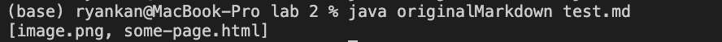
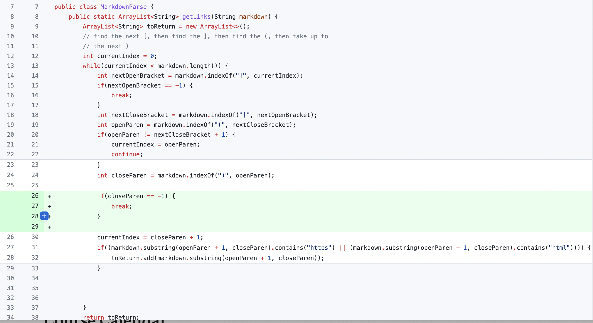

# Week 4 Lab Report
 
 
 
 

Original Code: [Link](https://github.com/ucsd-cse15l-w22/markdown-parse/blob/main/MarkdownParse.java)

## Code Change #1

The error inducing input: [test2.md](https://raw.githubusercontent.com/rkanGH/cse15l-lab-reports/main/lab%202/test2.md)
 
When the code is run with the input this is the error that is induced:

 
 
This error is occuring when we have text at the end of the last link. This is because when `currentIndex` is set to `closeParen` it is set as the index of the last `)`. However, there is a character after the last `)` which means `currentIndex` will always be less than `markdown.length` and the while loop will run forever. 
 

To summarize, the failure-inducing input of having a character after the last `)` resulted in bug in the code of not checking if there were any characters after the last `)` which led to the symptom of the while loop running forever.

 
 
 
 

## Code Change #2

The error inducing input: [test.md](https://raw.githubusercontent.com/rkanGH/cse15l-lab-reports/main/lab%202/test.md)

 
Although the code compiles and runs when the file is run, it produces the image's link which isn't what we want.
 
The original code has the output:
 
 

 
However, we do not want the `.png` link we want the code to only output the html link:
 
 

This error occurs because the code prints anything that is in the parenthesis with the markdown format. 

 
 
To summarize, the error inducing input of an image link resulted in the bug of not checking whether or not a link is actually in the parenthesis which then led to the code printing out the link that wasn't an actual link.
 
 
 
 

## Code Change #3

The error inducing input: 
