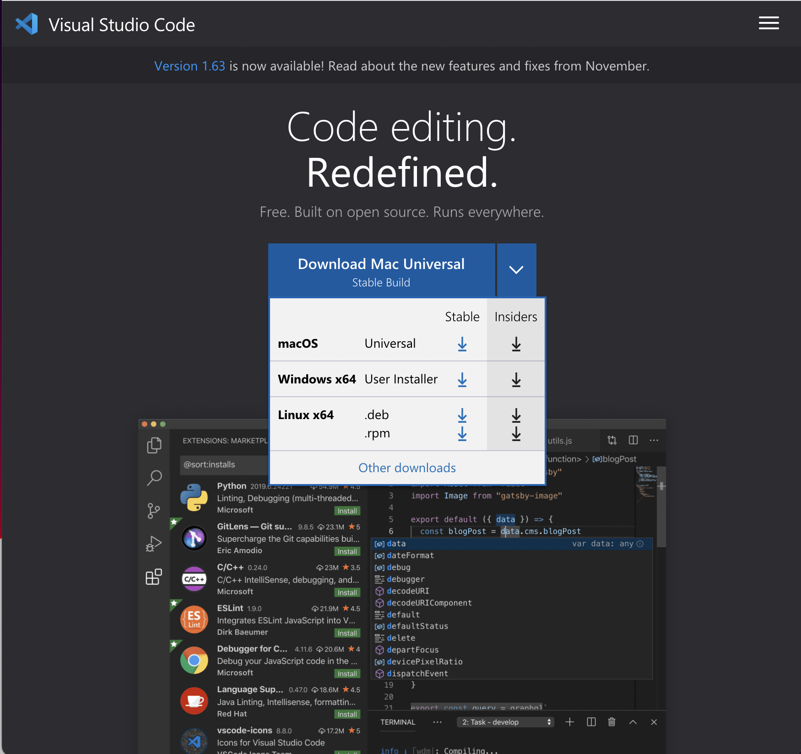
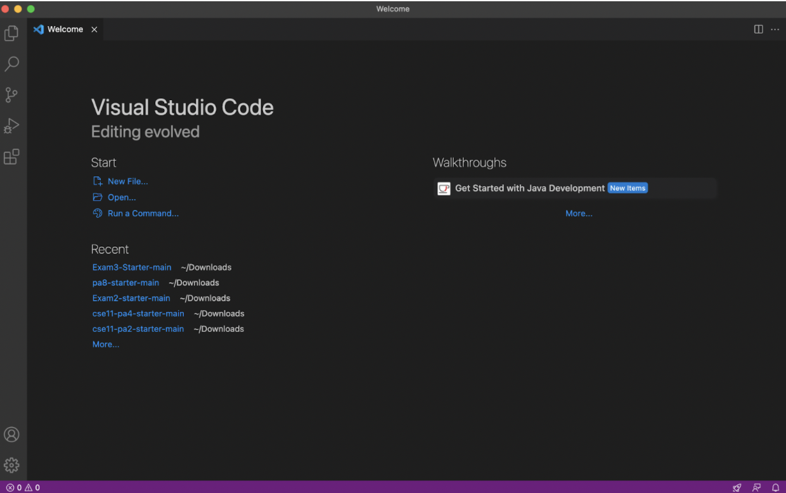
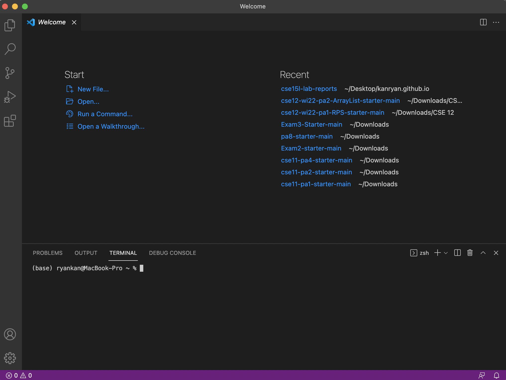
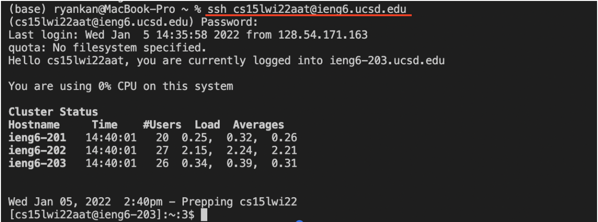
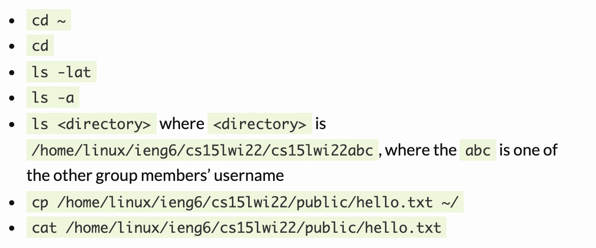
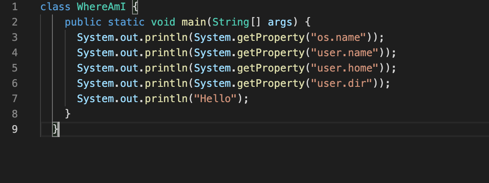
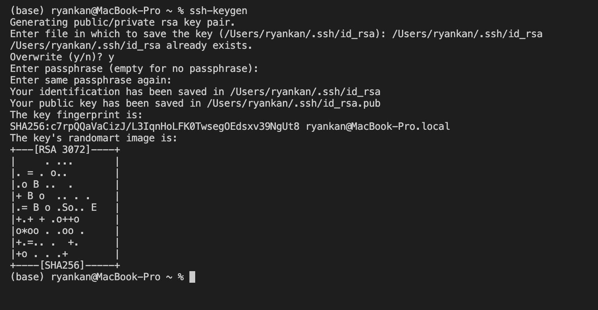
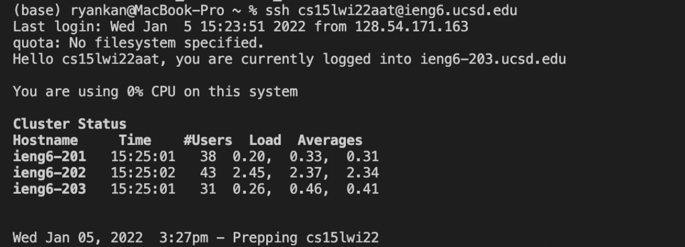
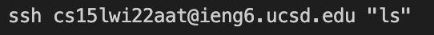
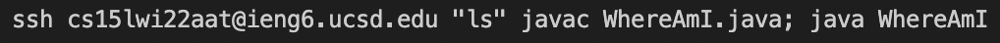

# How to Log onto ieng6
## 1. Install VSCode
* To log into a course-specific account on ieng6, we first want to download the VSCode IDE onto our computer.   
 * You can download the IDE from this link: [VSCode](https://code.visualstudio.com/).  
* Download according to your system: 
  
* After downloading VSCode open the application and should see a similar page:

## 2. Remotely Connect to a Computer
* Before connecting remotely, we want to access our course specific username and reset our password.   
To do that you must go to this link: 
[https://sdacs.ucsd.edu/~icc/index.php](https://sdacs.ucsd.edu/~icc/index.php)
  
* Once you have your username and new password, we want to open terminal in VSCode by using (control + `) or through  the menu option. If done correctly you should see something similar to this: 
  
* Once terminal is open, we need to  type in the command:
`ssh (Your Username)@ieng6.ucsd.edu`

My username is cs15wi22aat so I used `ssh cs15wi22aat@ieng6.ucsd.edu`
  
* After using the command, the terminal should prompt you for your password and once you enter your password you should see something like this:

  
* If you see this screen that means you have successfully connected!

## 3. Test Some Commands
* After successfully connecting, you should test some commands to see what happens. 
  
Here are a list of commands you can try:

## 4. Moving Files with scp
* Now we we want to practice moving files with the scp command from our computer to the online computer
  
* To do this create a file on your local computer called "WheremAmI.java" with the following contents:
 

  
* Next, in the terminal, run the following command:
 
  `scp WhereAmI.java (Your Username)@ieng6.ucscd.edu`
 
 
The terminal will prompt you for your password and you will enter it.

* After running the scp command line use `ls` to make sure the file WhereAmI is there. Then run it using javac and java. The output should be different from when you ran it on your computer.

## 5. Setting an SSH Key
* Now we will set up an SSH Key which will allow you to access the remote connection more easily. You will not need to a password to connect anymore.

* To do this we need to be on the local computer and use the command `ssh-keygen`. It will ask you to enter a file to save the key and you will put enter `/Users/(file path on your computer)/.ssh/id_rsa` then enter no passphrase twice and your screen should look like this: 

  
* Next, return to your local computer terminal and enter `ssh (Your username)@ieng6.ucsd.edu`
Enter your password then, type the command `mkdir .ssh` and logout. After this step you should be able to log in without a password.

## 6. Optimizing Remote Running
* Now that you don't need a password to remotely connect to the computer you can make your command running even more efficient by chaining commands.
  
* If you wanted to connect to the computer and use the command line `ls` you can use the following command: 
If you wanted to chain more commands you can use a semicolon to separate more commands.
