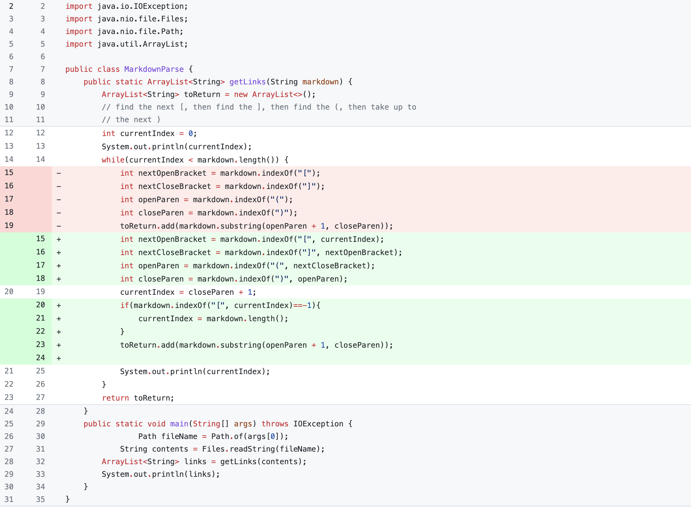
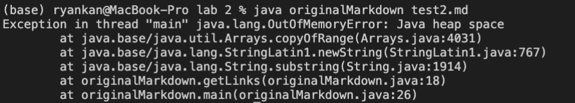
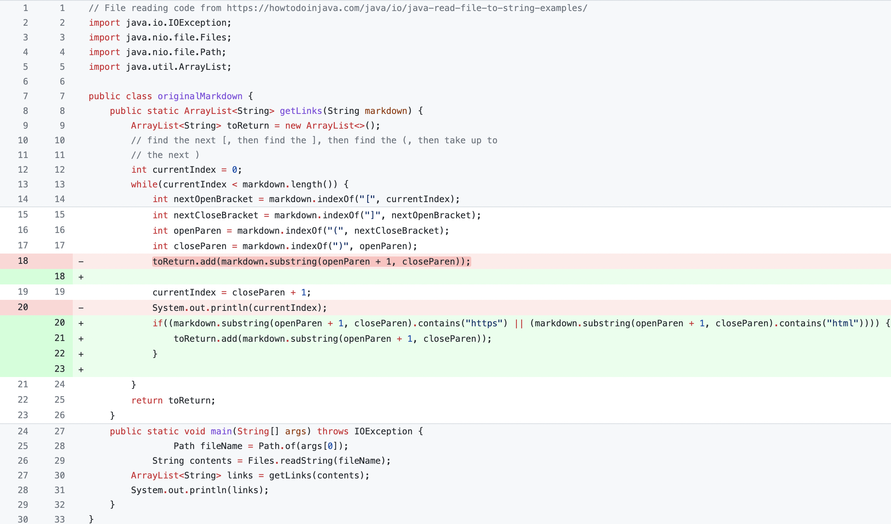
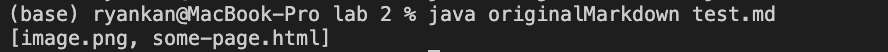
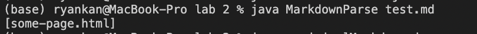
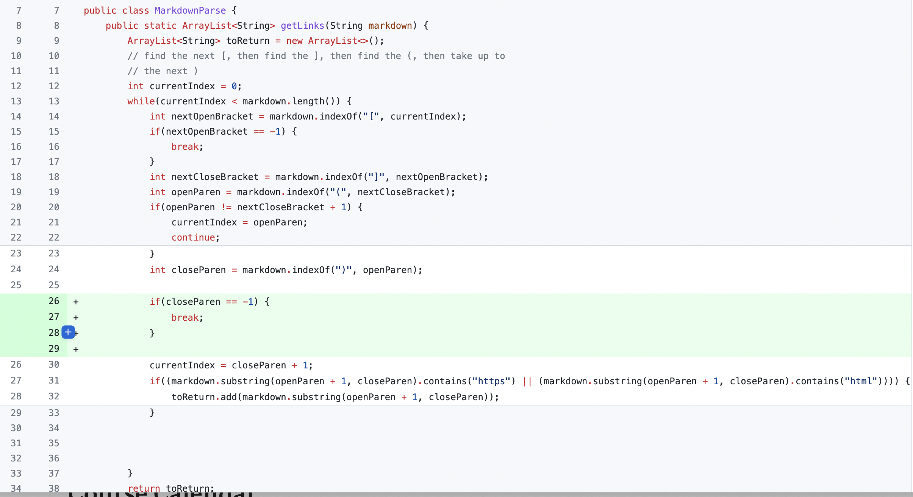
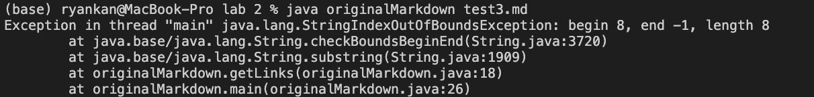

# Week 4 Lab Report
 
 
 
 

Original Code: [Link](https://github.com/ucsd-cse15l-w22/markdown-parse/blob/main/MarkdownParse.java)

## Code Change #1

The error inducing input: [test2.md](https://raw.githubusercontent.com/rkanGH/cse15l-lab-reports/main/test2.md)
 
When the code is run with the input this is the error that is induced:

 
 
This error is occuring when we have text at the end of the last link. This is because when `currentIndex` is set to `closeParen` it is set as the index of the last `)`. However, there is a character after the last `)` which means `currentIndex` will always be less than `markdown.length` and the while loop will run forever. To fix this problem I added an if statement to set `currentIndex` to the length of markdown if `markdown.indexof("[", currentIndex)` equals negative one.
 
 

To summarize, the failure-inducing input of having a character after the last `)` resulted in bug in the code of not checking if there were any characters after the last `)` which led to the symptom of the while loop running forever.

 
 
 
 

## Code Change #2

The error inducing input: [test.md](https://raw.githubusercontent.com/rkanGH/cse15l-lab-reports/main/test.md)

 
Although the code compiles and runs when the file is run, it produces the image's link which isn't what we want.
 
The original code has the output:
 
 

 
However, we do not want the `.png` link we want the code to only output the html link:
 
 

This error occurs because the code prints anything that is in the parenthesis with the markdown format. To fix this problem we added an if statement that would only add strings with `https` and `html` etc to toReturn so the code will only print the links we want.

 
 
To summarize, the error inducing input of an image link resulted in the bug of not checking whether or not a link is actually in the parenthesis which then led to the symptom of the code printing out the link that wasn't an actual link.
 
 
 
 

## Code Change #3

The error inducing input: [test3.md](https://raw.githubusercontent.com/rkanGH/cse15l-lab-reports/main/test3.md)
 

When the error inducing input is run we can see that there is a `java.lang.StringIndexOutOfBoundsException` error: 

 
 

This error occurs because on line 24 can see how `closeParen` is set to the index of of the next close parenthesis after `closeParen`. However, from the input file we can see that there is no ending parenthesis so when `markdown.indexOf(")", openParen);` is called `closeParen` is set as -1 because there is no close parenthesis. Thus, resulting in the index out of bounds exception. By adding an if statement that checks if the index of the close parenthesis is negative one and breaking the while loop if it is let me fix the problem. 

 

To summarize, the error inducing input of not having a close parenthesis resulted to the bug of setting `closeParen` to negative one which then led to the symptom of an `IndexOutOfBoundsException`.