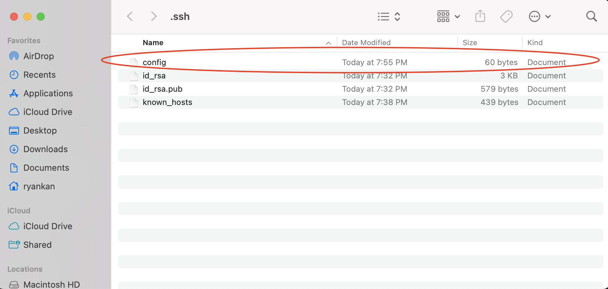
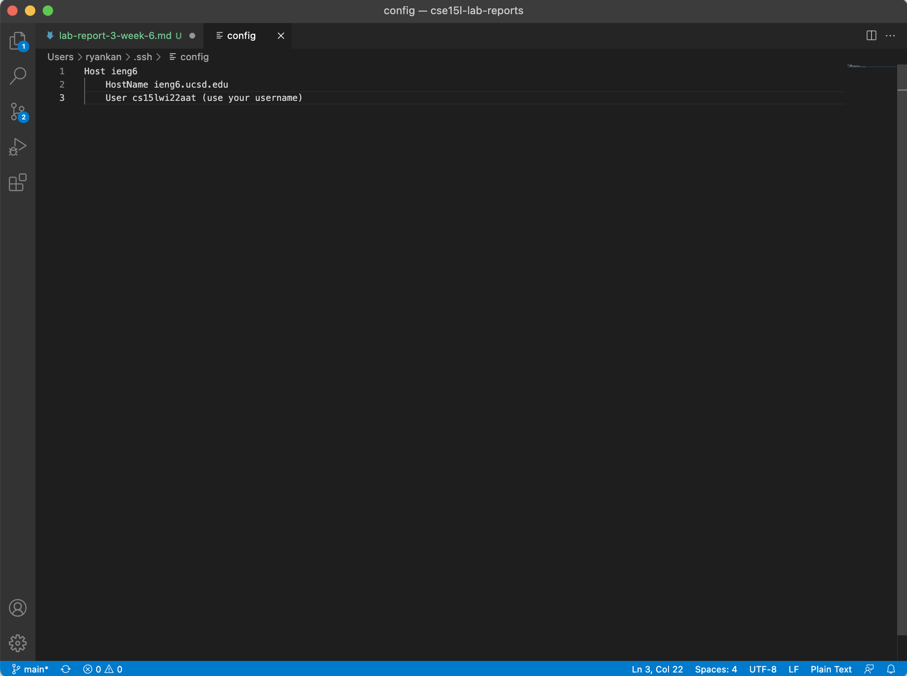
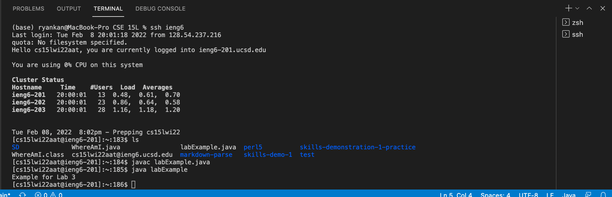
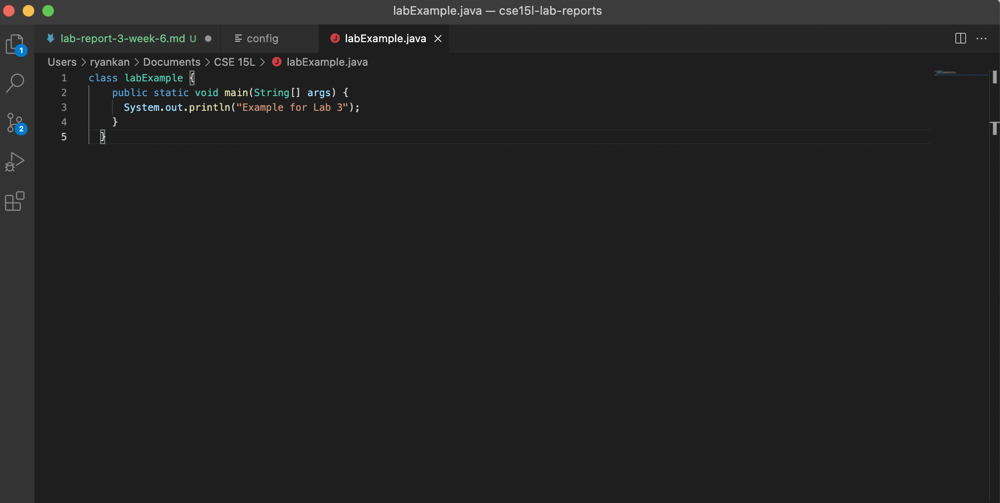
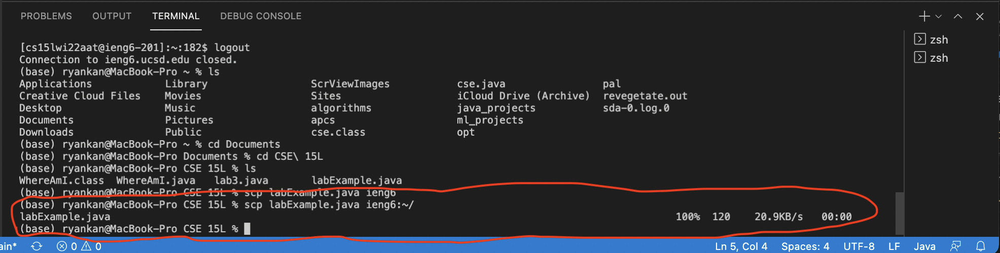

# Week 4 Lab Report
 

## Group Choice 3: Streamlining ssh Configuration
 
 

In this week's lab report I will show how I streamlined my ssh configuration

To normally when I log into ieng6 I would have to type in `ssh cs15lwi22aat@ieng6.ucsd.edu`.  

However, there is a way where I can make this more efficient so that I only have to type  `ssh ieng6`  to access the remote computer. 

 

The first step is we want to use the command `~/.ssh/config` in our terminal to create a new ssh folder. 

 

Next, we want to create a new file called `config` and move it to the ssh folder. If you are unable to find the ssh folder you can use `open .ssh` to open the folder and move the `config` file to the folder.

 

After creating the file you should have this in your file:

*Without the `(use your username)`*

Your user, however, should be your own unique course username.
You can change `ieng6` to anything you would like to use as your username to login to ieng6.

 

After you have created the `config` file you can  use the command `ssh (your new configuration)` to log onto ieng6. In my case I would use `ssh ieng6`. 

 

Now that we have a streamlined ssh configuration we can also `scp` files with a shorter command. Before streamlining we had to use the command `scp (filename) cs15wi22(your specific ID)@ieng6.ucsd.edu:~/`, but now that we have add the configuration we can replace the long ID line to whatever our saved username was. 
 

For example, for me instead of typing `scp (filename) cs15wi22aat@ieng6.ucsd.edu:~/` I just have to type `scp (filename) ieng6:~/` to run the command.

 

As an example I have created a file called `lab3.java` and I will `scp` it to the remote computer.

 

From `lab3.java` we can see that if we go to the remote computer after scping it to the remote computer and run the file it should print out `Example for Lab 3`.

