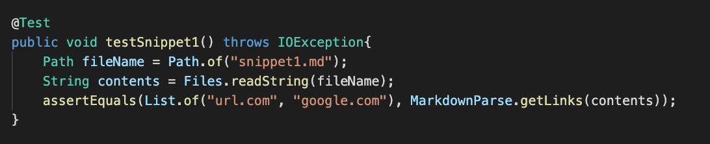
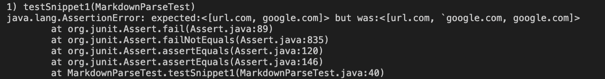
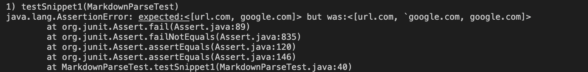
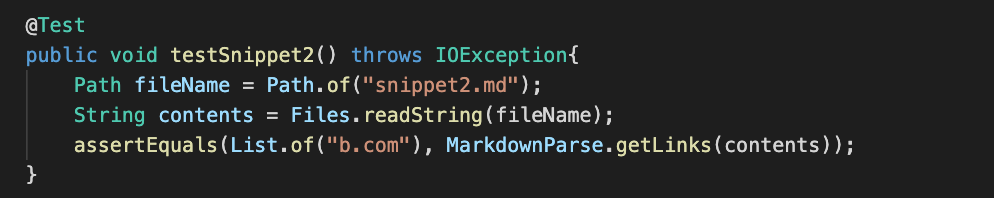
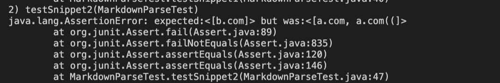
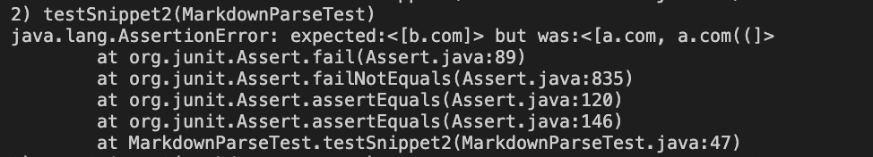
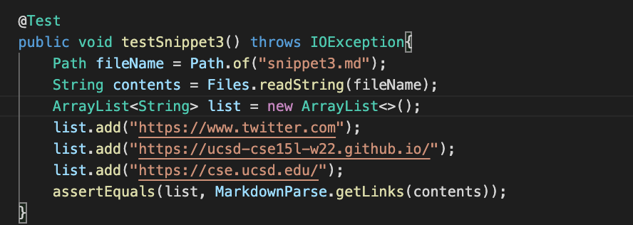
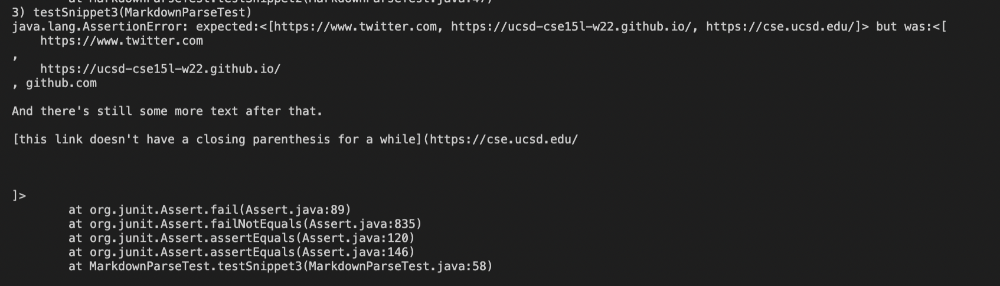
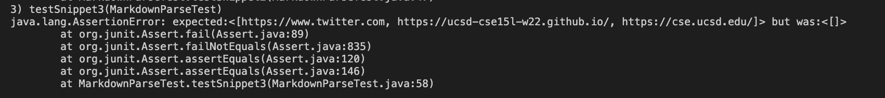

# Week 8 Lab Report
 

## Repository Links:
[My Repository](https://github.com/rkanGH/markdown-parse)
 
[Repository I reviewed](https://github.com/leo3friedman/markdown-parse)
 
 

## Snippet #1:
 
`[a link`](url.com)

[another link](`google.com)`

[`cod[e`](google.com)

[`code]`](ucsd.edu)

 

### Snippet #1 Test:

 
My implementation failed:

 

The Implementation I reviewed failed:

 
 

## Snippet #2:
 
[a [nested link](a.com)](b.com)

[a nested parenthesized url](a.com(()))

[some escaped \[ brackets \]](example.com)

### Snippet #2 Test:

 
My implementation failed:

 

The Implementation I reviewed failed:

 
 

## Snippet #3:
 
[this title text is really long and takes up more than 
one line

and has some line breaks](
    https://www.twitter.com
)

[this title text is really long and takes up more than 
one line](
    https://ucsd-cse15l-w22.github.io/
)

[this link doesn't have a closing parenthesis](github.com

And there's still some more text after that.

[this link doesn't have a closing parenthesis for a while](https://cse.ucsd.edu/

)

And then there's more text

### Snippet #3 Test:

 
My implementation failed:

 

The Implementation I reviewed failed:

