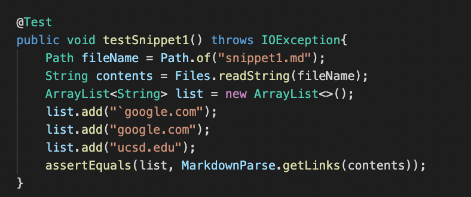
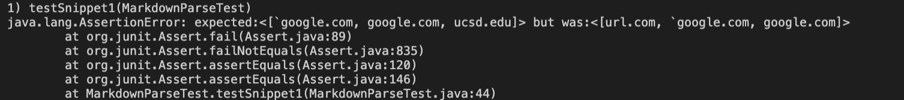
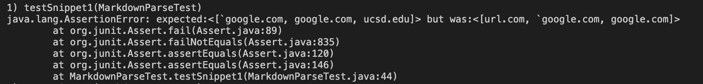
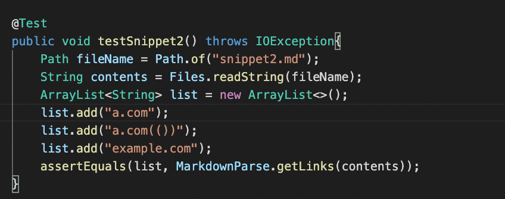
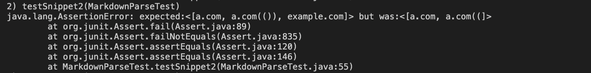
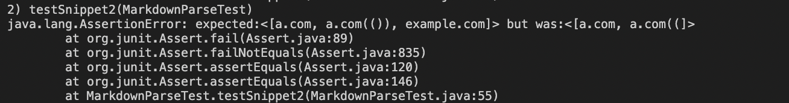
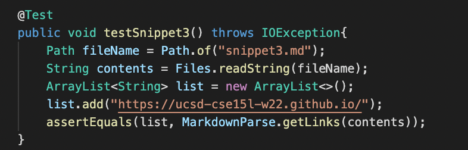
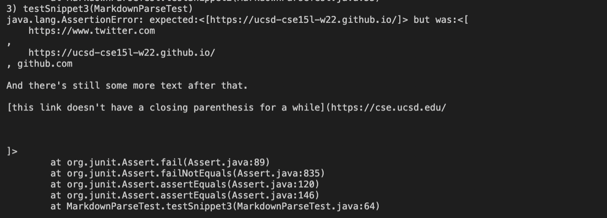
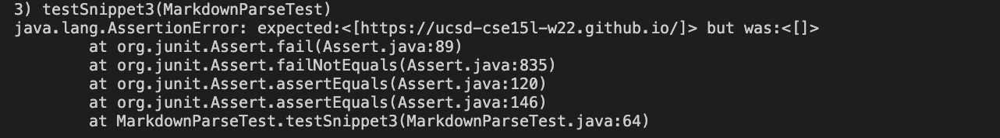

# Week 8 Lab Report
 

## Repository Links:
[My Repository](https://github.com/rkanGH/markdown-parse)
 
[Repository I reviewed](https://github.com/leo3friedman/markdown-parse)
 
 

## Snippet #1:
 
`[a link`](url.com)

[another link](`google.com)`

[`cod[e`](google.com)

[`code]`](ucsd.edu)

 

### Snippet #1 Test:

 
My implementation failed:

 

The Implementation I reviewed failed:

 
 

## Snippet #2:
 
[a [nested link](a.com)](b.com)

[a nested parenthesized url](a.com(()))

[some escaped \[ brackets \]](example.com)

### Snippet #2 Test:

 
My implementation failed:

 

The Implementation I reviewed failed:

 
 

## Snippet #3:
 
[this title text is really long and takes up more than 
one line

and has some line breaks](
    https://www.twitter.com
)

[this title text is really long and takes up more than 
one line](
    https://ucsd-cse15l-w22.github.io/
)

[this link doesn't have a closing parenthesis](github.com

And there's still some more text after that.

[this link doesn't have a closing parenthesis for a while](https://cse.ucsd.edu/

)

And then there's more text

### Snippet #3 Test:

 
My implementation failed:

 

The Implementation I reviewed failed:

 
 

## Questions:
1. I don't think there will be a code change less than 10 lines that will fix the code. I think it will be a more involved change because there will be several cases for me to check because there might be a backtick in the middle of the link which will make the link invalid. There might also be white space along with the backticks so I would also have to add a few lines of code to trim white space which will most likely make the changes more than 10 lines.

 

2.  I there could potentially be a change that can fix the code for these types of tests that is under 10 lines. I think an if statement along with a for loop can probably take care of this problem. We can have counters that keep track of the number of open and closing parenthesis, braces, or brackets.

 

3. I think that there is a way for me to change the code in under 10 lines that can fix this problem. I can probably have an a line of code that adds all the text between the brackets and the parenthesis to a string. Then with an if statement checking if there is a new line in the string and if there is remove the new line and return the link.