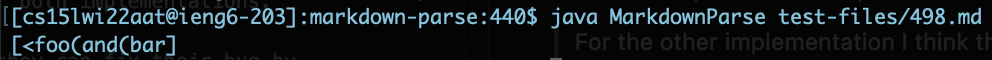
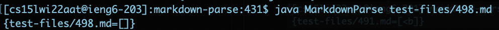
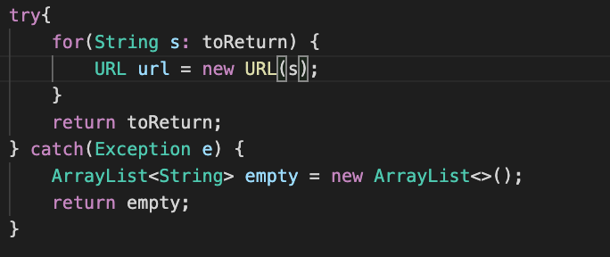
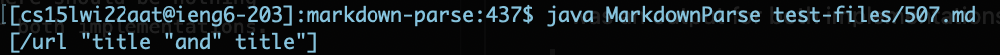
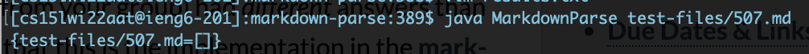

# Week 10 Lab Report
 

## Lab Report 5

 

To find the different results between the two code outputs I used `diff markdown-parse/results.txt ryan-markdown-parse/markdown-parse/own-results.txt`. 

 

I compared files 498.md and 507.md.

 

## First Difference 
File 498.md 

 

My implementation's output:

 

The other implementation's output:

For this test I think that my implementation is wrong because in the input file 498.md there was no actual link. I think to fix this, in my code I can import `java.net.URL` , then right before I return the string I can try creating a URL object and if theres is an exception thrown I will return an empty ArrayList.

This would be the code I would add at the end of the the getLinks method:

 

 

For file 507.md my implementation's output was:

 

The other implementation's output was:

For this test I think that my implementation is wrong because once again the input file actually contained no legitimate links. The correct output should be an empty array list. To fix this I can add at check right before the return and see if the output strings contain a space in between characters or check if the output string contains and special symbols that would appear in a link.

I would probably add a for loop with a if statement checking each string in the arraylist to see if the string contains spaces or any symbols that don't belong in a link. 

If the string contains the unwanted characters/symbols I will return an empty arraylist. If the string is valid I will return the string.
